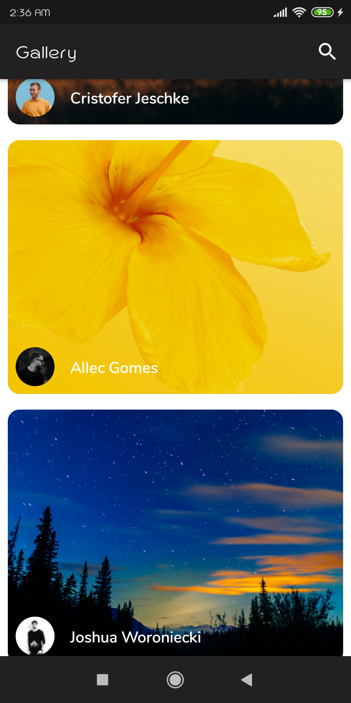
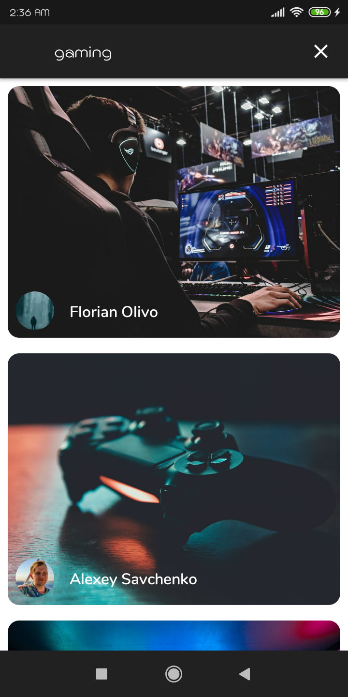
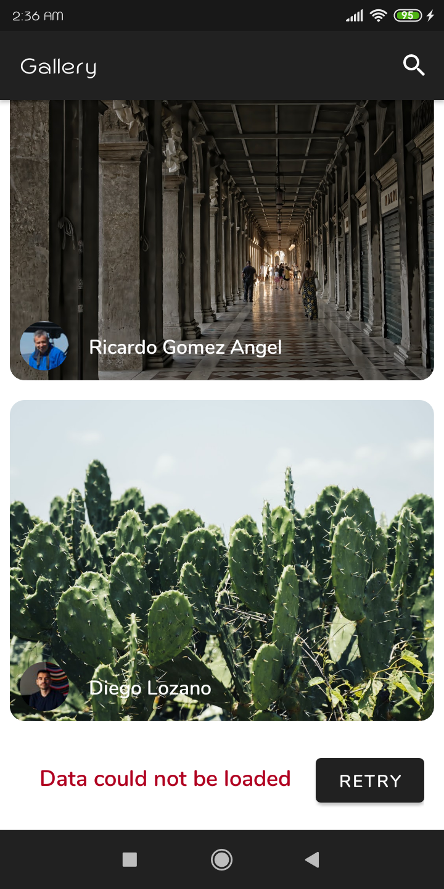
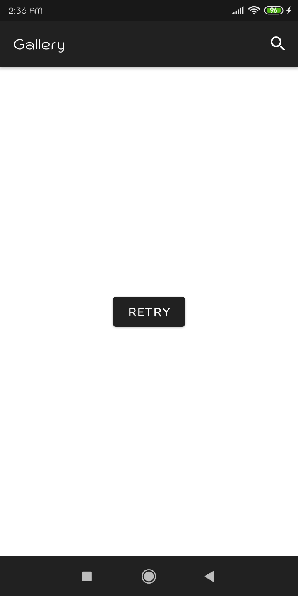

# Android-Paging-UnsplashApi

This is a small demo application based on modern Android application tech-stacks and MVVM architecture.
This project is for focusing especially on the library [Jetpack Paging 3](https://developer.android.com/topic/libraries/architecture/paging/v3-overview).

Fetching data from the network and integrating persisted data in the database via repository pattern  
(Room Persistence in [DatabaseBranch](https://github.com/viveksharma2382000/Android-Paging_3-UnsplashApi/tree/DatabaseBranch) because Remote Mediator of Paging 3 still in Experimental Phase).

### Tech stack & Open-source libraries
- Minimum SDK level 21
- [Kotlin](https://kotlinlang.org/) based, [Coroutines](https://github.com/Kotlin/kotlinx.coroutines) + [Flow](https://kotlin.github.io/kotlinx.coroutines/kotlinx-coroutines-core/kotlinx.coroutines.flow/) for asynchronous.
- Dagger-Hilt (alpha) for dependency injection.
- JetPack
  - LiveData - notify domain layer data to views.
  - Lifecycle - dispose of observing data when lifecycle state changes.
  - ViewModel - UI related data holder, lifecycle aware.
  - Room Persistence - construct a database using the abstract layer.
- Architecture
  - MVVM Architecture
  - Repository pattern
- [Retrofit2](https://github.com/square/retrofit)
- [Paging 3](https://developer.android.com/topic/libraries/architecture/paging/v3-overview)
- [Navigation](https://developer.android.com/guide/navigation)
- [Glide](https://github.com/bumptech/glide)
- [Material-Components](https://github.com/material-components/material-components-android)
- [Circular Image View](https://github.com/hdodenhof/CircleImageView)

### Architecture
App is based on MVVM architecture and a repository pattern.

### Open API
App using the [Unsplash API](https://unsplash.com/documentation) for constructing RESTful API

### Screenshots
   

  

### TODO
- Photo Details (Can use motion layout to learn)
